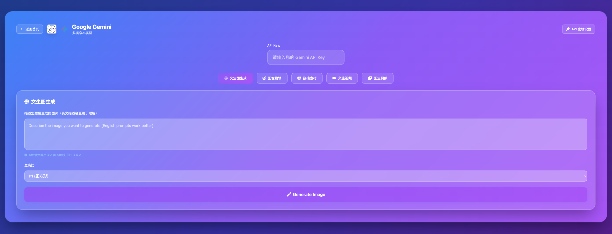

# Web UI for Large Models

[English](README_EN.md) | [中文](README_CN.md)

A beautiful and user-friendly Web UI interface for calling various functions of large language models. Supports Gemini API, providing text-to-image generation, video generation, image analysis and more features.

一个美观易用的 Web UI 界面，用于调用大语言模型的各种功能。支持 Gemini API，提供文本生成图片、视频生成、图片分析等功能。

## 🌐 在线体验 / Online Demo

体验地址 / Demo URL: [https://chanbaoai.cn/webui/](https://chanbaoai.cn/webui/)

## 📸 项目截图 / Screenshots

<div align="center">
  
  <p><b>Project Homepage / 项目主界面</b></p>
</div>

<div align="center">
  
  <p><b>Gemini Features / Gemini功能界面</b></p>
</div>

<div align="center">
  
  <p><b>Scan to add Dami Enterprise WeChat</b></p>
</div>

## ✨ Features / 功能特性

- 🎨 **Text-to-Image Generation** / **文本生成图片** - Generate high-quality images using Gemini Imagen model
- 🎬 **Text-to-Video Generation** / **文本生成视频** - Generate videos from text using Gemini Veo model
- 🖼️ **Image-to-Video Generation** / **图片生成视频** - Generate videos based on uploaded images
- ✏️ **Image Editing** / **图像编辑** - Intelligent image editing using Gemini API
- 🖼️ **Image Concatenation** / **图片拼接** - Horizontally concatenate multiple images with automatic size adjustment
- 🔍 **Image Analysis** / **图片分析** - Intelligent image content analysis
- 📱 **Responsive Design** / **响应式设计** - Support for desktop and mobile devices
- 🐳 **Docker Support** / **Docker 支持** - One-click deployment
- 🔧 **Easy Configuration** / **易于配置** - Simple environment setup

## 🚀 Quick Start / 快速开始

### Method 1: Using Startup Script (Recommended) / 方式一：使用启动脚本（推荐）

**Linux/Mac:**
```bash
git clone <repository-url>
cd webui_for_largemodels
./run.sh
```

**Windows:**
```cmd
git clone <repository-url>
cd webui_for_largemodels
run.bat
```

**Windows PowerShell:**
```powershell
git clone <repository-url>
cd webui_for_largemodels
.\run.ps1
```

### 📱 Access Pages / 访问页面

- **Homepage** / **主页**: http://localhost:8000/
- **Gemini Features** / **Gemini功能页面**: http://localhost:8000/gemini
- **API Documentation** / **API文档**: http://localhost:8000/api/docs

## 🔑 Getting API Key / 获取 API Key

1. Visit [Google AI Studio](https://aistudio.google.com/app/apikey)
2. Create a new API Key
3. Add the API Key to the `.env` file

## 📁 Project Structure / 项目结构

```
webui_for_largemodels/
├── app/                    # Main application code / 主应用代码
│   ├── main.py            # FastAPI entry point / FastAPI 入口
│   ├── routes/            # Route modules / 路由模块
│   ├── services/          # Business logic / 业务逻辑
│   ├── utils/             # Utility functions / 工具函数
│   └── templates/         # Frontend templates / 前端模板
├── static/                # Static resources / 静态资源
├── outputs/               # Generated files storage / 生成文件存储
├── logs/                  # Application logs / 应用日志
├── requirements.txt       # Python dependencies / Python 依赖
├── Dockerfile            # Docker configuration / Docker 配置
├── docker-compose.yml    # Docker Compose configuration / Docker Compose 配置
└── run.sh               # Startup script / 启动脚本
```

## 🚀 Deployment / 部署

### Docker (Recommended) / Docker（推荐）

```bash
# Set environment variables / 设置环境变量
export GEMINI_API_KEY=your_api_key

# Start services / 启动服务
docker-compose up -d
```

### Manual Installation / 手动安装

```bash
# Install dependencies / 安装依赖
pip install -r requirements.txt

# Start application / 启动应用
uvicorn app.main:app --host 0.0.0.0 --port 8000 --reload
```

## 🐛 Troubleshooting / 故障排除

### Common Issues / 常见问题

1. **Invalid API Key** / **API Key 无效**
   - Check if the API Key is correct / 检查 API Key 是否正确
   - Confirm the API Key has sufficient quota / 确认 API Key 有足够的配额

2. **File Upload Failed** / **文件上传失败**
   - Check file size and format / 检查文件大小和格式
   - Confirm disk space / 确认磁盘空间

### Log Viewing / 日志查看

```bash
# View application logs / 查看应用日志
tail -f logs/webui_$(date +%Y%m%d).log

# View Docker logs / 查看 Docker 日志
docker logs webui-for-models
```

## 🤝 Contributing / 贡献

Welcome to submit Issues and Pull Requests! / 欢迎提交 Issue 和 Pull Request！

## 📄 License / 许可证

This project is licensed under the MIT License. See the [LICENSE](LICENSE) file for details.

本项目采用 MIT 许可证。详见 [LICENSE](LICENSE) 文件。

## 🙏 Acknowledgments / 致谢

- [FastAPI](https://fastapi.tiangolo.com/) - Modern, fast web framework / 现代、快速的 Web 框架
- [Gemini API](https://ai.google.dev/) - Google's AI model API / Google 的 AI 模型 API
- [Tailwind CSS](https://tailwindcss.com/) - Utility-first CSS framework / 实用优先的 CSS 框架
- [Font Awesome](https://fontawesome.com/) - Icon library / 图标库

---

For detailed documentation, please refer to: / 详细文档请参考：
- [English Documentation](README_EN.md)
- [中文文档](README_CN.md)