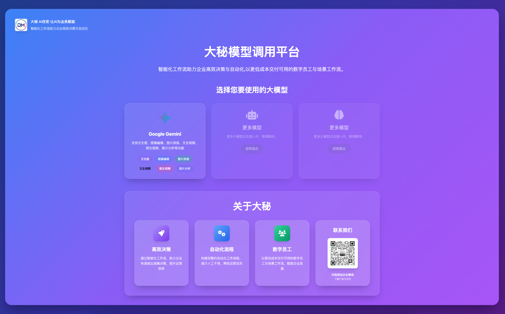

# 大模型 Web UI

一个美观易用的 Web UI 界面，用于调用大语言模型的各种功能。支持 Gemini API，提供文本生成图片、视频生成、图片分析等功能。

## 🌐 在线体验

体验地址：[https://chanbaoai.cn/webui/](https://chanbaoai.cn/webui/)

## 📸 项目截图

<div align="center">
  
  <p><b>项目主界面</b></p>
</div>

<div align="center">
  
  <p><b>Gemini功能界面</b></p>
</div>

<div align="center">
  
  <p><b>扫码添加大秘企业微信</b></p>
</div>

## ✨ 功能特性

- 🎨 **文本生成图片** - 使用 Gemini Imagen 模型生成高质量图片
- 🎬 **文本生成视频** - 使用 Gemini Veo 模型从文本生成视频
- 🖼️ **图片生成视频** - 基于上传图片生成视频
- ✏️ **图像编辑** - 使用 Gemini API 对图片进行智能编辑
- 🖼️ **图片拼接** - 横向拼接多张图片，自动调整尺寸
- 🔍 **图片分析** - 智能分析图片内容
- 📱 **响应式设计** - 支持桌面和移动设备
- 🐳 **Docker 支持** - 一键部署
- 🔧 **易于配置** - 简单的环境配置

## 🚀 快速开始

### 方式一：使用启动脚本（推荐）

**Linux/Mac:**
```bash
git clone <repository-url>
cd webui_for_largemodels
./run.sh
```

**Windows (命令提示符):**
```cmd
git clone <repository-url>
cd webui_for_largemodels
run.bat
```

**Windows (PowerShell):**
```powershell
git clone <repository-url>
cd webui_for_largemodels
.\run.ps1
```

启动脚本会自动：
- 检查 Python 环境
- 创建并激活虚拟环境
- 安装依赖
- 创建必要目录
- 启动应用

### 📱 访问页面

启动成功后，您可以通过以下地址访问：

- **主页（大秘公司介绍）**：http://localhost:8000/
- **Gemini功能页面**：http://localhost:8000/gemini
- **API文档**：http://localhost:8000/api/docs

### 方式二：手动安装

1. **创建虚拟环境**
```bash
python3 -m venv Webui_env
source Webui_env/bin/activate  # Linux/Mac
# 或
Webui_env\Scripts\activate     # Windows
```

2. **安装依赖**
```bash
pip install -r requirements.txt
```

3. **配置环境变量**
```bash
cp env.example .env
# 编辑 .env 文件，添加您的 Gemini API Key
```

4. **启动应用**
```bash
uvicorn app.main:app --host 0.0.0.0 --port 8000 --reload
```

### 方式三：使用 Docker

1. **构建镜像**
```bash
docker build -t webui-for-models .
```

2. **运行容器**
```bash
docker run -p 8000:8000 -e GEMINI_API_KEY=your_api_key webui-for-models
```

或使用 docker-compose：
```bash
# 设置环境变量
export GEMINI_API_KEY=your_api_key

# 启动服务
docker-compose up -d
```

## 🔑 获取 API Key

1. 访问 [Google AI Studio](https://aistudio.google.com/app/apikey)
2. 登录您的 Google 账户
3. 创建新的 API Key
4. 将 API Key 添加到 `.env` 文件中

## 📁 项目结构

```
webui_for_largemodels/
├── app/                    # 主应用代码
│   ├── __init__.py
│   ├── main.py            # FastAPI 入口
│   ├── config.py          # 配置管理
│   ├── routes/            # 路由模块
│   │   ├── __init__.py
│   │   ├── gemini.py      # Gemini API 路由
│   │   └── health.py      # 健康检查
│   ├── services/          # 业务逻辑
│   │   ├── __init__.py
│   │   ├── gemini_service.py  # Gemini 服务
│   │   └── file_service.py    # 文件服务
│   ├── utils/             # 工具函数
│   │   ├── __init__.py
│   │   ├── logger.py      # 日志
│   │   └── helpers.py     # 辅助函数
│   └── templates/         # 前端模板
│       ├── index.html     # 主页面
│       └── gemini.html    # Gemini页面
├── static/                # 静态资源
│   ├── css/
│   ├── js/
│   └── images/
├── outputs/               # 生成文件存储
│   ├── images/
│   ├── videos/
│   └── files/
├── logs/                  # 应用日志
├── requirements.txt       # Python 依赖
├── Dockerfile            # Docker 配置
├── docker-compose.yml    # Docker Compose 配置
├── run.sh               # 启动脚本
├── env.example          # 环境变量示例
└── README.md            # 项目说明
```

## 🎯 使用指南

### 1. 配置 API Key
- 点击右上角的 "API Key" 按钮
- 输入您的 Gemini API Key
- 点击保存

### 2. 文本生成图片
- 在"文本生成图片"区域输入描述
- 选择宽高比和生成数量
- 点击"生成图片"按钮
- 等待生成完成，可预览和下载

### 3. 文本生成视频
- 在"文本生成视频"区域输入描述
- 配置视频参数（宽高比、分辨率、时长等）
- 点击"生成视频"按钮
- 等待生成完成，可播放和下载

### 4. 图片生成视频
- 上传一张图片
- 输入视频描述
- 配置视频参数
- 点击"生成视频"按钮

### 5. 图像编辑
- 上传要编辑的图片
- 输入编辑提示词（描述您想要进行的编辑）
- 点击"编辑图片"按钮
- 等待AI处理完成，查看和下载编辑后的图片

### 6. 图片拼接
- 选择多张图片（至少2张）
- 系统会自动横向拼接图片
- 点击"横向拼接图片"按钮
- 查看和下载拼接后的图片

### 7. 图片分析
- 上传要分析的图片
- 输入分析提示词
- 点击"分析图片"按钮
- 查看分析结果

## 🔧 配置说明

### 环境变量

| 变量名 | 描述 | 默认值 |
|--------|------|--------|
| `GEMINI_API_KEY` | Gemini API 密钥 | 无 |
| `HOST` | 服务器地址 | `0.0.0.0` |
| `PORT` | 服务器端口 | `8000` |
| `DEBUG` | 调试模式 | `true` |
| `UPLOAD_FOLDER` | 文件上传目录 | `outputs` |
| `MAX_FILE_SIZE` | 最大文件大小（字节） | `104857600` |

### 支持的图片格式
- JPG/JPEG
- PNG
- WebP
- GIF

### 支持的视频格式
- MP4
- AVI
- MOV
- MKV

## 🚀 部署

### 生产环境部署

1. **设置环境变量**
```bash
export GEMINI_API_KEY=your_api_key
export DEBUG=false
```

2. **使用 Gunicorn 部署**
```bash
pip install gunicorn
gunicorn app.main:app -w 4 -k uvicorn.workers.UvicornWorker --bind 0.0.0.0:8000
```

3. **使用 Nginx 反向代理**
```nginx
server {
    listen 80;
    server_name your-domain.com;
    
    location / {
        proxy_pass http://127.0.0.1:8000;
        proxy_set_header Host $host;
        proxy_set_header X-Real-IP $remote_addr;
    }
    
    location /static/ {
        alias /path/to/your/static/;
    }
    
    location /outputs/ {
        alias /path/to/your/outputs/;
    }
}
```

## 🐛 故障排除

### 常见问题

1. **API Key 无效**
   - 检查 API Key 是否正确
   - 确认 API Key 有足够的配额
   - 检查网络连接

2. **文件上传失败**
   - 检查文件大小是否超过限制
   - 确认文件格式是否支持
   - 检查磁盘空间

3. **生成失败**
   - 检查网络连接
   - 查看日志文件
   - 确认 API 配额

### 日志查看

```bash
# 查看应用日志
tail -f logs/webui_$(date +%Y%m%d).log

# 查看 Docker 日志
docker logs webui-for-models
```

## 🤝 贡献

欢迎提交 Issue 和 Pull Request！

## 📄 许可证

本项目采用 MIT 许可证。详见 [LICENSE](LICENSE) 文件。

## 🙏 致谢

- [FastAPI](https://fastapi.tiangolo.com/) - 现代、快速的 Web 框架
- [Gemini API](https://ai.google.dev/) - Google 的 AI 模型 API
- [Tailwind CSS](https://tailwindcss.com/) - 实用优先的 CSS 框架
- [Font Awesome](https://fontawesome.com/) - 图标库

---

如有问题或建议，请提交 Issue 或联系维护者。
